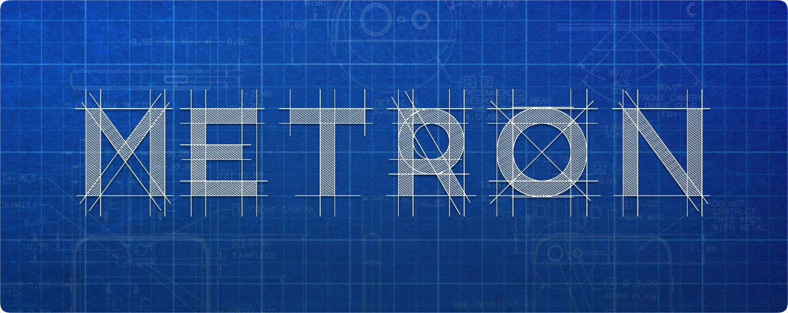

[](http://cocoapods.org/pods/Metron)
[](http://cocoapods.org/pods/Metron)
[](http://cocoapods.org/pods/Metron)

# Metron

_Gemeometry, simplified._

Metron is a comprehensive collection of geometric functions and types that extend the 2D geometric primitives provided by CoreGraphics. Completely written in Swift, Metron allows you to express complex geometric calculations in very intuitive statements:

**Example 1.**

```swift
Circle(in: viewFrame).contains(touchPoint)
```
↳ creates a `Circle` that fits (centered) inside `viewFrame`, and checks if the `touchPoint` is inside that circle.

**Example 2.**

```swift
(Angle(.pi) + Angle(270, unit: .degrees)).normalized // Angle of 0.5pi (90°)
```
↳ adds two `Angles`, one expressed in radians (default) and one in degrees. The sum is normalized to within 0 and 2𝛑 radians *(or 0 and 360 degrees)*.

**Example 3.**

```swift
LineSegment(a: startPoint, b: currentPoint).intersection(with: viewFrame.lineSegment(for: minYEdge))
```
↳ creates a `LineSegment` between a (touch) start point and current point, and returns the intersection with the `minYEdge` of a view's frame (if these line segments indeed intersect).

**Example 4.**

```swift
let rotatedPoints = viewFrame.points.map { $0.applying(rotationTransform, anchorPoint: rotationPoint) }
let path: CGPath = Polygon(points: rotatedPoints).path
```
↳ maps each corner point of a view's frame (a `CGRect`) to a point to which a `rotationTransform` is applied, taking `rotationPoint` as the anchor point for the transform.
With these points, a `Polygon` is initialized, representing the rotated rectangular frame of the view. From that polygon, we derive a `CGPath` that can then be drawn.


## And there's much more...

### Extensions

#### For CGPoint

- [X] Distance to other `CGPoint`
- [X] Clipping to `CGRect`
- [X] Relative position in `CGRect`
- [X] Normalized position in `CGRect`
- [X] Convert to `CGVector`
- [X] Round to non-decimal components
- [X] Addition, subtraction, multiplication...
- [X] Convex hull for an array of `CGPoints` (returns a `Polygon`)

#### For CGVector

- [X] Magnitude
- [X] Angle
- [X] Convenience initializer with magnitude and angle
- [X] Convert to `CGPoint`
- [X] Inverse
- [X] Dominant edge
- [X] Dominant corner
- [X] Derive line through point
- [X] Derive line segment from point
- [X] `CGAffineTransform` extensions
- [X] Addition, subtraction, multiplication...

#### For CGSize

- [X] Area
- [X] Swap width and height
- [X] Clip to other `CGSize`
- [X] Scaling using multiplication and division

#### For CGRect

- [X] Many convenience initializers, including AspectFit / AspectFill for size
- [X] Scaling
- [X] Corner points
- [X] Edges as line segments
- [X] Area
- [X] Center
- [X] Perimeter
- [X] `CGPath`

#### For CGRectEdge

- [X] Axis (x or y)
- [X] Adjacent corners
- [X] Opposite edge

#### For CGAffineTransform

- [X] Create translation transform using `CGVector`
- [X] Apply transform with a specified anchor point

### New Types

#### Line

- [X] Slope
- [X] Y-intercept
- [X] X-intercept
- [X] Horizontal? / vertical? / parallel(to: ...)?
- [X] Get a perpendicular line
- [X] Determine intersection with other `Line` or `LineSegment`

#### LineSegment

- [X] Length
- [X] Derive a `Line`
- [X] Rotate
- [X] Determine intersection with other `Line` or `LineSegment`
- [X] `CGPath`

#### Circle

- [X] Radius
- [X] Diameter
- [X] Circumference
- [X] Area
- [X] Center
- [X] Width / Height
- [X] Bounding rect
- [X] Contains point?
- [X] `CGPath`
- [X] Points along the perimeter (divide the circle into steps, rotating in a specific direction...)

#### Triangle

- [X] Vertices (as `CGPoint`)
- [X] Sides (as `LineSegment`)
- [X] Angles (as `Angle`, see further on)
- [X] Angle bisectors (as `LineSegment`)
- [X] Altitudes (as `LineSegment`)
- [X] Equilateral? / isosceles? / scalene? / right? / oblique? / acute? / obtuse?
- [X] Centroid
- [X] Circumcenter
- [X] Incenter
- [X] Orthocenter
- [X] Area
- [X] Bounding rect
- [X] Contains point?
- [X] `CGPath`

#### Square

- [X] Edge length
- [X] Area
- [X] Perimeter
- [X] Center
- [X] `CGPath`
- [X] `CGRect`

#### Polygon

- [X] Init with points or with line segments
- [X] Edge count
- [X] Self-intersecting?
- [X] Convex? / concave?
- [X] Area
- [X] Perimeter
- [X] Center
- [X] Bounding rect
- [X] Contains point?
- [X] `CGPath`

#### Corner

- [X] Adjacent edges (`CGRectEdges`)
- [X] Opposite corner

#### Angle

- [X] Init with radians or degrees
- [X] Convert unit
- [X] Normalize
- [X] Invert
- [X] Compare
- [X] Addition, subtraction, multiplication...
- [X] Basic trigonometric functions also accept `Angle`
- [X] Create rotation `CGAffineTransform` with `Angle`


## Installation

### CocoaPods

Metron is available through [CocoaPods](http://cocoapods.org). To install
it, simply add the following line to your Podfile:

```ruby
pod "Metron"
```

### Carthage

Metron is also available through [Carthage](https://github.com/Carthage/Carthage). To install
it, simply add the following line to your Cartfile:

```
github "toineheuvelmans/Metron"
```

### Swift Package Manager

Metron can also be used with the [Swift Package Manager](https://swift.org/package-manager/). Add Metron to the `dependencies` value of your `Package.swift`:

```swift
dependencies: [
    .Package(url: "https://github.com/toineheuvelmans/metron.git", majorVersion: 1)
]
```

## Suggestions or feedback?

Feel free to create a pull request, open an issue or find me [on Twitter](https://twitter.com/toineheuvelmans).

## License

Metron is available under the MIT license. See the [LICENSE](LICENSE) file for more info.
